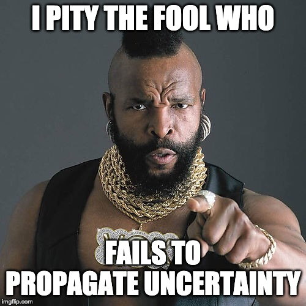

```{r setup, include = FALSE, cache = TRUE, echo = FALSE}
# chunks options:
# hide code and messages by default (warning, message)
# cache everything 
knitr::opts_chunk$set(eval = TRUE, 
                      warning = FALSE, message = FALSE,
                      cache = TRUE,
                      fig.retina = 2,
                      fig.align = "center", dpi = 100)
# Xaringan: https://slides.yihui.name/xaringan/
library("xaringan")
library("xaringanthemer")
library("here")
mono_light(base_color = "#003333",
          link_color = "#000080",
          #background_color = "#FAF0E6", # linen
          header_font_google = google_font("PT Sans"), 
          text_font_google = google_font("Old Standard"), 
          text_font_size = "30px",
          padding = "10px",
          code_font_google = google_font("Inconsolata"), 
          code_inline_background_color    = "#F5F5F5", 
          table_row_even_background_color = "#E6F0FA",
          extra_css = 
            list(".remark-slide-number" = list("display" = "none")))
```

```{r, eval = FALSE, include= FALSE}
# setup
devtools::install_github("yihui/xaringan")
devtools::install_github("gadenbuie/xaringanthemer")
install.packages("webshot")
webshot::install_phantomjs()
library(webshot)
# export to pdf
file <- here("present/whyMail-APW.html")
webshot(file, "whyMail-APW.pdf")
```


# Overall
- Clearly written
- Clarifies important concepts that have been used very sloppily
- Answeres a big, elusive question
- Teaches us about stats, as well as primaries
  - propegates measurment uncertianty through model stages

---

>"All ideal point estimates are uncertain, but not many studies confront this uncertainty."



---

# Summary of comments:
- Clarify terminolgy and scope
- Framing (*stratigic positioning* vs. *representation*|DIME as the DV)
- Do I understand the measures, model, & results?
- Robustness checks
- Am I updating my priors correctly?
- Thoughts on ontology and causality (possibly nonsense) 

???

Mike has clearly thought about this so carefully, that I sincerly doubt that I can offer anything thing that pushes the thinking in any way. 
I see my role here as commenting on what is more or less clear as a reader. The thoughts it triggered in my mind and how well that alligns with how you intend me to be updating my prioprs. 

I'll suggest some robustness checks becasue I know you are into that kind of thing

I also just want to re-terate some of the important contributions.


---

# Summary

People blame primaries for
- polarization
- selecting general-election losers
- populism

--

BUT, we have yet to observe preferences of local partisans.

--

Mike estimates ideal points for each districts' partizans. 

--

So, do primaries work? 

--

YES
--
, MGD scores predict candidate DIME scores (even when blocking effects through past voting signals)

---

# Theory

Primaries work if the
1. local partizan voters'
1. policy prefrences/ideologies
1. are represented in/transmited into government

Implication: If primaries work, a district's partizans' prefrences should affect
- Chapter 4: Who runs (and their positions)
- Chapter 5: Who wins

???


Mike helpfully gives us a clear definition that allow us to contrast theory and findings

---

## 1. "local partizan voters" (the median thereof)
  - (**×**) citizens
  - (**×**) voters
  - (**×**) district partisanship
  - (**?**) partizan citizens
  - (✓) likely partizan voters (population of the latent concept, $\theta$)
  - (✓) partizan identifiers (population generating the data, $y$)
  - (**×**) informed partizan voters (alternative concept). "informational demands that voters may not meet"
  - "bottom-up ideological pressure from voters"
  
--

**Naming things!** 😬 "district-party publics" vs "district-party groups" vs "partisan constituency" --> "the ideology of a district's partizans" maybe?

---

## 2. "policy prefrences"/"ideologies"

How sensitive are these ideal points to survey item inclusion and weighting? 

--

Policy items <-> *Grey area* <-> Not policy items

---

You downweight repeated observations from the same individual. This makes sense. 
1. It would have no effect in world where everyone is asked 20 questions, correct? 
1. Is this the same as upweighting responses to shorter surveys? 
1. Reasonable weight bounds: We learn more from a 20-question survey than a 10-question survey, but not as much as two 10-question suveyes. Can you test or sample weights in that range? 
--
(The results are 100% survey-dependent, but how much do they vary depending on which survey is weighted more heavily within these logical bounds).

---


## 3. "into government"

Does this mean that only **competitive** races matter? 

Or might primaries "work" on unchallenged incunbents through the threat of a challenger? 

Maybe downweight challengers in non-compettive races because they are more open to oddball candidates that add noise in places where we don't expect the primary to really "work" anyway. 

---

# When should primaries **not** work? 

1. Unchallenged candidates (?) 
1. Uncompetitive districts (?)
1. Uncompetitive candidates (✓)

Are a-typical candidates/donors responsible for the higher varience in DIME scores for challengers and open seats? Are these outliers long-short candidates? What if we drop them? 

???

Lots of donors only give to conventional candidates they think can win (esp. incombants), so the higher correlation here may be more a function of time  than your measure. 


---

# Measurement-DIME Scores

(How to frame this chapter)

**DIME ~ Stratigic candidate positioning?** 
If not, not so informative regarding the stragic positioning delema per se (but this is fine)

**DIME ~ Credible candidate policy comitments?** 
If so, good for testing the core representation hypotheses (**do primaries work?**)

**DIME ~ Informal party networks?**
If so, are we recovering the correlation between district ideology and party networks? 

---

background-image: url(mgd-scores.png)
background-size: contain

---

# Measurement-DeCrescenzo Scores

I would be intersted in Figure 4.1 with uncertianty around your measure.

That level of separation! (Much more than DIME scores). Do the party mean estimates have a strong pull or that the battery is fairly partisan? The most conservative local dems are way more liberal then the most liberal local Republicans. 


Are cutpoints generally less than 0? 

???

You may not want to put this in the paper, but I would be intersted in figure 4.1 with uncertianty around your measure--I imagine this would show a lot less separation. 

I thought they averaged to 0

---


# Model

The unit of observation is $DIME_i$ (4.4-4.7), but only $\overline{DIME}_g$ is identified (4.2.1), correct?

--

> the variables that could confound the relationship between citizen and candidate ideology could differ dramatically across parties

Thus separate models by party ✓

> incumbency status appears to be a substantial modifier of the relationship between citizen and candidate ideology

By this logic, must we estimate incumbants separatly? (Say more about why this is not just a candidate trait.)


---

# Mediation

A districts past vote share likely influences candidate positioning (and decisions to run). However, it may do so primarily *because* primaries exist, Thus,
1. If the effect of ideology is 100% mediated, primaries might still "work" and thus total effect may be more relevent.
1. What we really want to block is the portion of the effect of past presidential vote share that is *not* due to its signal of district ideology (i.e., the mediated effect). The way you calculated average total effect does this, right?  It is just a matters of emphasis about what is blocked and why. 

---

> $z_i$ currently contains an order-3 polynomial function of candidate i’s total campaign receipts. Why? 

Is this an intermediate confound between past presidential vote share and candidate DIME score? 

---

> "we should be concerned that district features that promote conservative voters also promote conservative candidates"

> " it is important to demonstrate that it affects candidate positioning above and beyond its intermediate effect on district voting."

But the role of background features depend on the selection process. Do background features have direct effects? For example, does this mean we want to exclude the effect of the fact that the candidate is a draw from the partizan voter pool? Primaries work if the draw is centered on the mean of this group, not more likely to come from the left or right tails of the distribution of partizans in a district? (Approximated by estimating the relationship between $\bar{\theta}_g$ and $\over{DIME}_g$.) Is this what we mean whe we are estimating the medaited effect of district partizans? 

---

# Vote choices (vote share) varies, but voters' policy prefrences do not? 
- 4.3.1 Does this over-estimate the effect of previous vote share on donor patters (DIME scores vary over time as candidates come and go)? 


---

# Updating 

Figure 4.4: Past vote share is only an informative for Dem Challengers. The more Republican the district, the more conservative a Democrat challenger's donors are, right? 

---

# Interpretation

## Under what conditions do a district's partizans policy prefrences diverge from the policy prefrences* of candidate slate? 

*donation patterns

Is this even the right question? 


---

## Under what conditions do a district's partizans ideologies != vote choice? 

1. not all district partizans vote
1. voters choose candidates for reasons other than policy positions measured on surveyes

---

# Ontology & Causality

> "Ideology *affects* responses"

> "Data *depend on* the construct"

> "Items *reveal* different information about the latent construct"

Our brains are models (true idology exists, *is* a "cause", a "force")

Latent variable: 
vs.

> "IRT lets us summarize an individual's policy prefrences"

Latent construct: We construct ideology from responses (true ideology *is* responses to an infinate number of questions? )

???

I would not normally go down this path, but I figure that you might actually care, have answers for these such obtuse questions that help me make sense of them.

---


----


---


> In a policy choice context, the difficulty parameter is better understood as the “cutpoint” parameter, the midpoint between two policy choices where the respondent is indifferent between the choice of Left or Right on item j.

This phrasing could track the above and below sentences better to stress thas cutpoints, like difficulty, are features of a item, not a respondent. Perhaps this is as simple as saying the "mean respondent is indifferent." I would actually introduce the cutpoint language in the educational paragraph above, so you don't have to intoduce two things at once here, and so you can just use cutpoint going forward.

> "how much to cut capital gains taxes will have a more conservative cutpoint than a question of whether to cut capital gains taxes at all."

This example is confusing because the response scales also seem to differ. Try "whether to cut capital gains tax by 50% will have a more conservative cutpoint than whether to raise capital gains tax by 50%" or "whether to cut capital gains tax by 50% will have a more conservative cutpoint than whether to cut capital gains tax by 1%"

Figure 2.1 could have shading/color for difficulty and line type for discrimination (solid lines for ι = 1)

Instead of "behave identically," you could say "be as difficult/conservative and as discriminating..."

I like "their ideal point" rather than "her ideal point" for the generic person.

> "standard Normal utility error from εi j above"

nbd but I don't see any equasion with εi j above

Not important, but given how nice you walk through every other step, you could explain the move from individual to population standard deviation in Equasion 2.8

Might as well say "partizan voters in a district" rather than partisan citizens in a district"

The discription of 4.2 uses different notation than the figure.

Figure 4.4 is pretty, but could be a little clearer if there were boxes around the facets (it takes a second to realize that there are 3 x axes). Also the 0 line from 4.5 is nice (this might actually be all you need). 

---

# Typos?

> where groups are define as 

> policy ideology with a partisan constituency

the policy ideology of a partisan constituency?

The strength of these relationships vary

That setup violates likely violates the

whereas most Dime scores

Figures 4.4 and 4.5, DIME not Dime, meh

simulation-based statistics they are more stable estimators

All ideal point estimates are uncertainty
