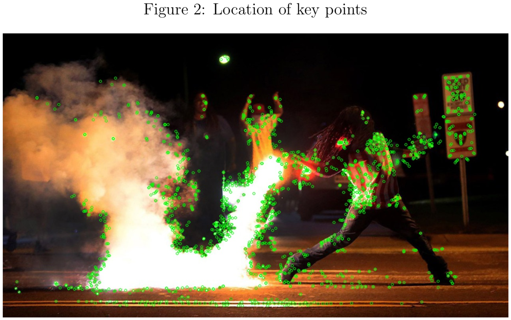
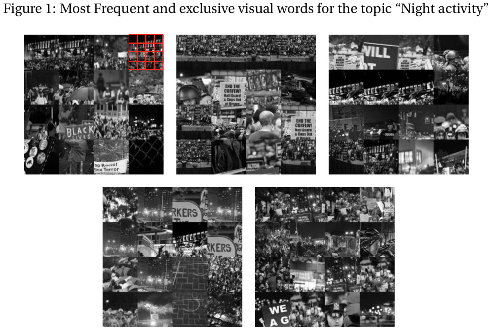
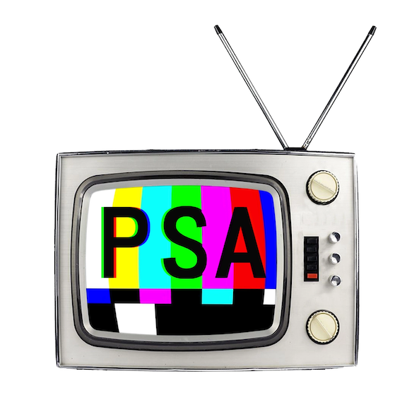

```{r setup, include = FALSE, cache = TRUE, echo = FALSE}
# chunks options:
# hide code and messages by default (warning, message)
# cache everything 
knitr::opts_chunk$set(eval = TRUE, 
                      warning = FALSE, message = FALSE,
                      cache = TRUE,
                      fig.retina = 2,
                      fig.align = "center", dpi = 100)
# Xaringan: https://slides.yihui.name/xaringan/
library("xaringan")
library("xaringanthemer")
library("here")
mono_light(base_color = "#003333",
          link_color = "#000080",
          #background_color = "#FAF0E6", # linen
          header_font_google = google_font("PT Sans"), 
          text_font_google = google_font("Old Standard"), 
          text_font_size = "25px",
          padding = "10px",
          code_font_google = google_font("Inconsolata"), 
          code_inline_background_color    = "#F5F5F5", 
          table_row_even_background_color = "#E6F0FA",
          extra_css = 
            list(".remark-slide-number" = list("display" = "none")))
```

```{r, eval = FALSE, include= FALSE}
# setup
devtools::install_github("yihui/xaringan")
devtools::install_github("gadenbuie/xaringanthemer")
install.packages("webshot")
webshot::install_phantomjs()
library(webshot)
# export to pdf
file <- here("present/whyMail-APW.html")
webshot(file, "whyMail-APW.pdf")
```

## Clear argument and  writing
## Great leap in methods
## Combines cutting-edge tools to discover patterns + experimental evidence about causal effects

<!--
The writing is clear, and I agree with all of your premises and conclusions, and why it is important, so my commments focus on a few small tweeks to the methods and framing, and next steps in this broader project. 
- on the observational side, I have what I hope is, given your mastery of images, a very doable suggestion for a more direct hypothesis test, given the nature of your hypotheses. 
- on the experimental side, my suggestions for follow up experiments are likely for the next paper

This paper got me thinking so I have a lot of notes that I will go though quickly and send them to you by email.
-->

---

# Summary

## 1. Visual topic model 

Conservative media --> more image features we might call "night" (dark, high-contrast)

--

## Summary of thoughts:

- More from the topic model?
- More direct tests?

--

=> *Discovering* vs. *testing* for **mood** vs. **environment** vs. **objects**


---

## 2. Experimental findings

- Peaceful image --> no effect on efficacy or support, but more objection to police violence
- Protestor violence --> less efficacy, less support
- Police violence --> less efficacy, less support?
<!-- Especially surprising because police violence is against people, protestor "violence" focuses on property! -->
--

- Images > words, except for "the police went too far" 

<!--(because images are more ambiguous than text and thus allow assumptions to hold?)-->
--

## Summary of thoughts:
- More integration of computer vision and experiment sections?
- Combine samples for both experiments?
- What are the mechanisms?
- What would we find in other contexts? 

---

# Visual topic model 

<!-- I use topic models and remember your award-winning polmeth poster, and I went back and read that paper to dig into the method. But if I misundersand anything, I hope that your corrections of my misunderstandings will help others who may not use these models--> 



---



---

BoVW method (Torres 2018)

1. select *key point* (edges and corners, sharp changes in color, i.e. not background, sky, street, wall, etc.)

--

2. characterize *gradients* for pixels around those key points <!--(e.g. transitions from light to dark, or Red to Green or Blue)--how many getting lighter, how many getting darker, weighted by magnitude (how much lighter or darker) -->

--

3. assign it to nearest *Visual Word* ("vocabulary" cluster centroid)

--

=> sharp gradients (brightness, contrast), possibly shapes, **objects**? 

--

**Task**

>"**identify** topics providing information about the **time and place** in which the protests occurred (e.g. night)"

--

**Suggestion:** Keep background (skip the key point step) to retain **environmental** features (e.g. night vs. day sky)?

---

## Exploring data, testing hypotheses

<!-- I am sure you have recieved a lot of feedback about the method in general, but this paper has some specific and important hypotheses -->

>"test the expectation that conservative newspapers are more likely to use nocturnal frames"

**Simpler Task:** How to *measure* "night" in images?

--

**Suggestions:**

(1) Inspect topic models with different $k$s, pick one with the most "nocturnal-looking" topic.

--

(2) Identify the "most nocturnal" topic or topics in many models, average proportions. 

--

(3) Discover patterns, design more direct tests features of interest (observational or experimental) 
- e.g. dark and high contrast images


<!-- Given your expertise and the night hypotheses, it may be easy to construct much more direct observational tests. -->

---

(4) Model environmental and mood latent feature structure simultaniously with object features

--

Are image fragments draws from a distribution of "night" or "something else" with a probability that varies by image? 

--

Or are image fragments draws from a distribution of **objects** that vary (in brightness and contrast) depending on whether they are drawn from a "night" or "day" image? 

--

Can we model **mood** variation (in global tint, brightness, contrast) alongside *object clusters* (local variation, edges, corners, etc. at key points)? 

--

If we can model night/day variation, we could identify variation in **what** is depicted at night and day?

---

<!-- Boring PSA, easy for you to do, but I suspect you will cosign that if people are using topic models, I'll want to see the rest of the topics and alterntive models summarized because TOPIC PROPORTIONS are a function of other topic proportions and k --->

**Regardless of exploratory or testing use of topic models**, we all should report in appendicies:

- all topics for models used (e.g. top words via FREX)
- models with different $k$s 

Topic proportions are conditional on other topics (and thus also $k$)




---

## What else pops out? 

--

Can topic models recover anything we might label with the concepts tested experimentally?

For example, can you recover latent dimensions for 

*peaceful* vs. *violent* features?
- e.g. crowds (✓) vs. flames (?)

--

*police violence* vs.  *protestor violence* features?
- e.g. riot gear objects vs. broken glass objects

(perhaps a better task for CNNs or other supervised methods using object libraries)

---

# Next steps?

1. Mechanisms 

There are a lot of potential mechanisms here. You are clearly thinking about this, but perhaps some of my thoughts about disentangling mechanisms will be useful if you go further down this path. 

2. Other movements

Minor tweaks to this paper's framing could leave the door open for different findings for **reactionary movement** protests. 


<!-- As you note, protests are not conservative because they aim to disrupt the status quo, but there are reactionary movements, like white power and blue lives matter protests, that aim to resist looming changes or reverse ones that have already occurred. -->

---

## Variables

Viewer:
- disposition (equality, hierarchical structures and need for order)
- social context?

What is shown: 
- violence
 + intensity
 + object/direction
 + against people or property?
- protest content?

How it is shown:
- color tint?

---

# Expectations about mechanisms

--

## Expectation about night / dark framing

A bunch of related expectations: 

- Night
- Image brightness
- High contrast
- Greyscale and redscale? 

"protest paradigm"
- deviant, threatening, imponent 

---

## Expectations about violence

Logics of consequences: risk vs. benefit (?)
- safety 
- likelihood of success

--

Logics of appropriateness: ideological and social distance
- legitimacy of tactics<!-- (could also explain results, esp. given the power of text to remove ambiguity)-->
  - assumption that police start violence (x)
  - assumption that protestors start violence (?) 
- legitimacy of claims/proof of injustice (x)
- compassion/indignation (x)

--

Valence (?) <!-- (could also explain result)-->
- negitivity (discomfort, anxiety, linked with crime)
- arrousal

---

## Expectations about attitudes

> "higher levels of hierarchy-enhancing attitudes to be less susceptible to visual frames of violence in protests and to overall report negative perceptions"

--

Police violence? (Riot gear, bodies on the ground)

--

Pro-hierarchy protest? (Swasticas, blue line flags)

--

Protestor on protestor violence?

--

Symbolic violence (Guns, flags, symbols)

--

Property damage vs. violence?
- blood, teargas, or ambulance (bodily injury) vs. fire or broken glass (property damage)

---

Other small notes:

- I am not exactly sure what "fairness" means on page 5. Perhaps that a perception that there is a problem implies that the status quo is unfair?
- Minor typo on page 5 "participation at in social movements."
- On page 10, by "initialized with 12 topics," you just mean that you set $k=12$ or do you mean that some algorithm chose $k$, but you initialized it with a prior of $12$?  
- Figure 3 is labeled "Topics"--should be "Night activity topic," right? 
- The intro to section 4 starts with a second lit review. This is unconventional, and the paper may be better integrated by combining
- On page 24, I would not say that they trust the text more, just that the text undermined a baseline assumption that protestors start violence, whereas the image was more open to interpretation. This is evidence for blame/identity hypotheses over cost-benefit hypothesis. 