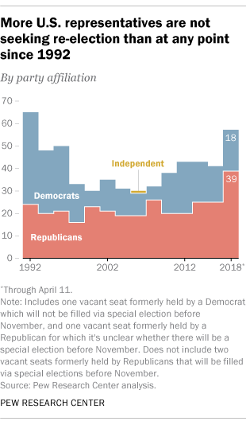

```{slidewhow, include = FALSE, eval = FALSE}
output:
  xaringan::moon_reader:
    lib_dir: libs
    mathjax: "https://cdn.bootcss.com/mathjax/2.7.1/MathJax.js?config=TeX-AMS_HTML"
    css: xaringan-themer.css
    nature:
      highlightStyle: github
      highlightLines: true
      countIncrementalSlides: false
    text_font_size: 2em
editor_options: 
  chunk_output_type: console
```

```{r setup, include=FALSE}
## Sets defaults for R chunks
knitr::opts_chunk$set(echo = TRUE, # echo = TRUE means that your code will show
                      warning=FALSE,
                      message=FALSE,
                      fig.retina = 2,
                      fig.align = "center", 
                      dpi = 100,
                      # fig.path='Figs/', ## where to save figures
                      fig.height = 3,
                      fig.width = 3)
library(here)
```


### Does experience matter in primary elections? (without incumbents)
### Cool new data on candidate occupations!
- Mostly out-party primaries? (i.e. those who have little chance of winning office)

### + Early money data!

<!--
## Findings:
"inexperienced candidates are faring better than ever before"
- especially Republicans (Tea party?)
- money matters
--> 

---
## Data 1980-2016 
(models 1-2 use 2012-2016, 3-6 use 2004-2016)

#### Election
- Number of candidates
- District preferences

#### Candidate
- Gender
- Money
- Previous campaigns
- (current?) occupation
1. Experienced, Elected
2. Experienced, Non-elected/"inexperienced candidates from political/governmental/legal background"
3. Inexperienced


---
## Theory

<!-- Try to formalize the driving hypothesis--> 

### The value of experience changed
H1: Inexperience once hurt, now it (A) hurts less, (B) helps. 
<!-- I buy at least the weak version of this, but what is the most likely alternative--> 

Pr(win|expierence, t1) > Pr(win|expierence, t2)
- Or expierence X GOP X open seat?

--

### Because of early money
H2: Early money (A) explains change in experience advantage (p. 20) because (B) it is more important to inexperienced candidates (p. 24).

Pr(win|inexpierence, money)-Pr(win|inexpierence, no money) > Pr(win|expierence, money)-Pr(win|expierence, no money)
- Or expierence X money X GOP X open seat?

---


## Models 

### Seperate models vs. interactions
Which intereactions?
- [ ] # of candidates X party
- [ ] 2+ expierenced candidates X party
- [ ] 60+% president vote X party
- [x] South X party
- [?] Total money X party
- [  ] Closed Primary X party
- [?] Redistricting X party

### Redistricting cycles == pre-post Citizens United

### Bootstrapped errors for predicted probabilities with conditional logit

---

## Findings: Novice GOP candidates:

### 1. Increased win rate in open-seat primaries 2008-2016 (Fig. 2)

--

### 2. Raised more money in 2012-2016 than 2004-2010 (Fig 7a)

--

### 3. Wins more correlated with money in 2012-2016 than 2004-2010 (Fig. 6a-b)

--

### 4. Received more extreme donations in 2016 than 2004 (Fig. 7b)


---

<!-- raises some interesting questions-->

### What about experience depends on party? 
- Most inexperienced GOP wins in the data are in open seats (p. 17)
- Is the win rate greater in open seats? More open seats recently?

--

Expectations for open seat vs. out-party
- Out-party candidates are often party insiders. It's a stepping stone, right?
- Open seat races likely to get more money, better candidates


---

### Alternative hypothesis: Winable general elections attract (A) more money and (B) better inexperienced candidates who sometimes win primaries.

---

## Mechanisms
### *Value* of inexpiernece or *correlates* of inexpierence?

Outsider status boosts outsider rhetoric (value)

<!-- Would be cool to test this-->

More money dilutes expierence advantage (?)

The rise of activists (?)
- A tea party story?

--

Selection effects?
- weak opponent
- weak party
- recruitment
- "ambitious amateurs" "self-selecting into the best races"

---

## Next steps?

#### How to leverage more of your cool data.

| | In-party | Out-party |
|:---------|:---------:|:---------:|
|Incumbant | ? | ?     |
|No incumbant, but anther office holder| **x** | X   |
|No office hoders|?| ? | 

<1,000 of 24,306 candidates. Is anything the same elections with an incumbent or with no experienced candidates? What about Pittenger/Harris, Cantor/Brat, and Crowley/AOC? Do early money or outsider mechanisms operate with an incumbent? (among challengers, controlling for incumbency and incumbents' early money)
<!-- test this or drop the frame, as it overshadows the contribution on almost every page-->


- More stories about occupations (lawyers, doctors, bosses)

- Testing tea party effects/outsider rhetoric connection

- Address selection effects and winnable general election hypothesis


---

Minor notes:

- Intro could better setup body

- My advisors are always on me to keep theory up front (e.g. maybe move up some of pgs. 17-20)

- Pg. 9: "Beyond a dichotomous DV"? *Update:* After reading the results, I understand, but the two different dichotomous DVs could be introduced more clearly.

- Pg. 10: 24k candidates is impressive! How many are incumbents? How many are in non-incumbent elections? How many non-incumbent elections total (i.e. the N for Figure 1?  A table or plot of each type by *open seat* and or *district competitiveness* would be an interesting descriptive.

- Pg. 11: "more restrictive measure" language not previously introduced. Maybe a pithy version of table A2 

- Pg. 11: What is the N for figures 1 and 2?

- Figures 1 & 2: It would be helpful to have this for non-open seat elections, as these are the bulk of the data in the model.

- Pg. 11: Would be interesting to see figures 1 and 2 with the 3-category definition. 

- Pg. 12 What are the "competing explanations"--general vs. conditional "inexperience advantage?"

- Table A.2 by party would be interesting.

- A figure instead of Table 1 would be nice.

- Pg. 14 How many are open seat? 

- Pg. 14 Cor(logged total spending, open-seat)?

- Pg. 15 "Our analysis only includes those non-incumbent races where at least one experienced candidate ran in the primary." And one inexperienced candidate, right?

- Pg. 16: These models use the restrictive definition? 

- Pg. 15-17 nitpicky: "not significantly more likely" vs. "no evidence"

- Pg. 18. Were lawyers in "experienced" before, or are they coming from "non-experienced"

- Figures 3 and 4 show distributions over three types per election. A stacked bar graph seems best suited to this. It would be more clear that the increase in inexperienced winners comes at the expense of prior office holders, not those with other relevant experience. Alternatively, a stacked bar graph with just these two types would be more clear than lines. 

- Figures 2/3 and 3/4 show very similar information and could be streamlined into one or two figures.

- Figure 5 axes could be more intuitive

- Why are table 1 models only reported for 2012-2016 but table 2 also models earlier years? 

- Footnote 15 seems to say that we expect most variables to be conditional on party because we observe differences in the DV by party. I don't understand this. Is this not like saying that because we observe differences in height by gender, we expect all predictors of height to have differing effects by gender?

- Pg. 24: Party contributions/endorsement seems really interesting. I would love to see more descriptives using this. 

- Pg. 25: I don't see how Table 2 shows that "probability of winning a primary election for candidates who had previously held elected office was 83 percent"--a figure might be better. If these are just predicted probabilities, then holding fundraising at $0 seems odd. The mean or mode (as you do for the predicted effects of money) seems more standard.

- Footnote 23: At what level is this difference in probabilities significant?

- Table 2: open seat vs. out party is omitted from these models. How do we know that money is not just picking up the effect of open seats? 

- Table 2: I wonder if the interaction "inexpierence*pac fundrasing" is actually the interaction you want to test. You find a weak negative effect for expierence x money, but the theory is more about inexpierence x money, and I am not sure that these two intereactions test the same thing.

- Page 27: I assume you are holding the two candidates with money constant at the mean for that party and time.

- Pg. 28: What portion of observations does this hypothetical describe. I might worry about the inference if most cases do not have two competitive candidates, one with experience, one without. (I'm still not clear if these data contain cases where only experienced candidates ran.)

- Figure 6: It might be simpler to just compare predicted probabilities for candidates with no money and one with the median. 

- Figure 6: I honestly don't quite understand how bootstrapping works for a conditional logit, but these confidence intervals seem very small given the number of observations and model standard errors.

- Figure 7a might be more striking if the later time periods were presented relative to the early baseline, drawing attention to the shift. Again, unlogged x-axis labels would be helpful.

- Figure 7a: It is not clear that dropping only poor performing inexperienced candidates is right; why not drop all poor performing candidates (should be roughly the same)? Or none to avoid suspicion. (It would just inflate the 0, right?)

- I found parenthetical notes about experience being a measure of "quality" distracting. I think experience is important enough that references to quality in the body of the text are unnecessary.

- Appendix A1: No CI for figures a and b

- Experience coding was for all past positions mentioned, right? Not just current? "code indicating her highest level of political experience or her most relevant qualification for holding office"

- What is the relationship between professions and outsider rhetoric? Do some professions help outsider rhetoric more than others?

- What kind of professions are good for each party? Differentiation of professions by party brands? This is probably super confounded by selection effects (a businesswoman running for a Dem seat is probably higher quality than the average GOP businesswoman candidate)

- Alternative DV: Vote share. Candidates that got twice as much of the vote. 

- If inexperienced candidates are also extreme, how do we know if voters are choosing based on experience or ideology? 

- Can you separate primaries that were on the same day as the president do tease out president effects (e.g. Trump effect in 2016)?

- How do you deal with candidates that run more than once? Cluster errors? 


